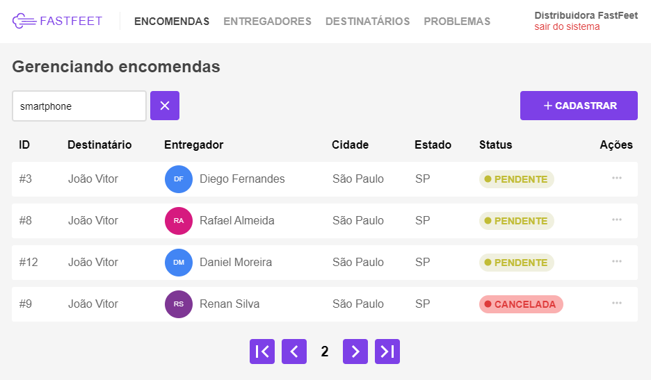

<!-- PROJECT LOGO -->
<h1 align="center">
  <a href="https://github.com/jvitormf/rs_bc_fastfeet">
    
  </a>
</h1>

<!-- BADGES -->
<p align="center">
  
  
  
  
  
  <a href="https://www.linkedin.com/in/jvitormf/">
    
  </a>
</p>
<p align="center">
  <a href="LeiaMe.md">
    Clique aqui para versão em Português.
  </a>
</p>


<!-- TABLE OF CONTENTS -->
# Table of Contents

* [About the Project](#boom-about-the-project)
  * [Built With](#gear-built-with)
    * [Tools](#tools)
    * [Common (Back-end, Front-end)](#Common-(Back-end,-Front-end))
    * [Back-end](#back-end)
    * [Fron-end](#front-end)
* [Getting Started](#rocket-getting-started)
  * [Prerequisites](#clipboard-prerequisites)
  * [Installation](#zap-installation)
    * [Docker](#docker-installation)
    * [FastFeet](#fastfeet-installation)
    * [Back-end](#back-end-installation)
    * [Front-end](#front-end-installation)
* [License](#memo-license)
* [Contributing](#bulb-contributing)
* [Contact](#e-mail-contact)
* [Acknowledgements](#exclamation-acknowledgements)
<!-- * [Usage](#usage)
* [Roadmap](#arrows_clockwise-roadmap) -->


<!-- ABOUT THE PROJECT -->
# :boom: About The Project

<!-- Project image -->



### Description

"Fastfeet" it's a challenge created by [Rocketseat](https://rocketseat.com.br/) for its students to create the whole application from scratch to fully working software. The idea is to use the skills learned in the GoStack Bootcamp, with the technologies Node.js, React and React Native.

The software is a fictitious transporter app and it has the following features:
* deliveryman, order, and recipients (create, edit, delete)
* deliveryman receive an email when an order is created or canceled
* each deliveryman can only do 5 deliveries per day
* file upload
* Pickup and deliveries confirmation
* Pickups are allowed between 08h and 18h

### More details
  * [FastFeet step 1](https://github.com/jvitormf/bootcamp-gostack-desafio-02)
  * [FastFeet step 2](https://github.com/jvitormf/bootcamp-gostack-desafio-03)
  * [FastFeet step 3](https://github.com/jvitormf/bootcamp-gostack-desafio-09)
  * [FastFeet step 4](https://github.com/jvitormf/bootcamp-gostack-desafio-10)

## :gear: Built With
  ### Tools
  * [VSCode](https://code.visualstudio.com/)
  * [Docker](https://www.docker.com/)
  * [Yarn](https://yarnpkg.com/)
  * [Insomnia](https://insomnia.rest/)
  * [Postbird](https://www.electronjs.org/apps/postbird)
  * [Reactotron](https://infinite.red/reactotron)

  [:arrow_up: Back to top](#table-of-Contents)

  ### Common (Back-end, Front-end)
  * [Eslint](https://eslint.org/)
  * [Prettier](https://prettier.io/)
  * [Date-fns](https://date-fns.org/)
  * [Yup](https://github.com/jquense/yup)

  [:arrow_up: Back to top](#table-of-Contents)

  ### Back-End
  * [Bcryptjs](https://github.com/dcodeIO/bcrypt.js)
  * [Bee-queue](https://github.com/bee-queue/bee-queue)
  * [Cors](https://github.com/expressjs/cors)
  * [Dotenv](https://github.com/motdotla/dotenv)
  * [Express](http://expressjs.com/)
  * [Jsonwebtoken](https://github.com/auth0/node-jsonwebtoken)
  * [Multer](https://github.com/expressjs/multer)
  * [Nodemailer](https://nodemailer.com/about/)
  * [Pg](https://github.com/brianc/node-postgres)
  * [Pg Hstore](https://github.com/scarney81/pg-hstore)
  * [Sentry](https://sentry.io/welcome/)
  * [Sequelize](https://sequelize.org/)
  * [Youch](https://github.com/poppinss/youch)
  * [Nodemon](https://nodemon.io/)
  * [Sucrase](https://sucrase.io/)

  [:arrow_up: Back to top](#table-of-Contents)

  ### Front-End
  * [Axios](https://github.com/axios/axios)
  * [History](https://github.com/ReactTraining/history)
  * [Immer](https://immerjs.github.io/immer/docs/introduction)
  * [Polished](https://polished.js.org/)
  * [React](https://pt-br.reactjs.org/)
  * [React Avatar](https://www.sitebase.be/react-avatar/)
  * [React Icons](https://react-icons.netlify.com/#/)
  * [React Redux](https://react-redux.js.org/)
  * [React Router Dom](https://github.com/ReactTraining/react-router/tree/master/packages/react-router-dom)
  * [React Select](https://react-select.com/home)
  * [React Toastify](https://fkhadra.github.io/react-toastify/introduction)
  * [Styled Components](https://styled-components.com/)
  * [Unform](https://unform.dev/)
  * [Customize Cra](https://github.com/arackaf/customize-cra)
  * [React App Rewired](https://github.com/timarney/react-app-rewired)

[:arrow_up: Back to top](#table-of-Contents)

<!-- * [React Native](https://reactnative.dev/) -->


<!-- GETTING STARTED -->
# :rocket: Getting Started

To get a local copy up and running follow these simple steps.

## :clipboard: Prerequisites

* Node.js - [Install guide](https://nodejs.org/en/download/package-manager/)
* Yarn - [Install guide](https://classic.yarnpkg.com/en/docs/install/#windows-stable)
* Docker - [Install guide](https://docs.docker.com/get-docker/)

[:arrow_up: Back to top](#table-of-Contents)


## :zap: Installation

  ### Docker Installation

  * Run the commands below to create the required containers
    ```sh
    #Create a Postgres container with a fastfeet database
    docker run --name pg_fastfeet -e POSTGRES_PASSWORD=postgres -e POSTGRES_DB=fastfeet -p 5432:5432 -d postgres
    ```

    ```sh
    #Create a Redis container
    docker run --name rds_fastfeet -p 6379:6379 -d -t redis:alpine
    ```

  [:arrow_up: Back to top](#table-of-Contents)

***

  ### FastFeet Installation

  * Clone the rs_bc_fastfeet
    ```sh
    git clone https://github.com/jvitormf/rs_bc_fastfeet.git
    ```

  [:arrow_up: Back to top](#table-of-Contents)

***

  ### Back-end Installation

  * Navigate to the backend folder and run the command below to install the required packages
    ```sh
    yarn
    ```
  * In the backend folder, create a `.env` file with the `.env.example` and fill it with the required variables, (APP_SECRET and Mail variables)

    * You can use [Mailtrap](https://mailtrap.io/how-it-works) to get the info for the Mail variables


  * Run the commands below to create the database tables.

    ```sh
      yarn sequelize db:migrate
      ```

  * Run the commands below to populate the database tables.

    ```sh
      yarn sequelize db:seed:all
      ```

  * To sign in, use `admin@fastfeet.com` email and password `123456`


  * And finally to let the API up and running
    ```sh
      yarn dev
      ```
  * Open another terminal and run the command `yarn queue` to start the mail process.

  [:arrow_up: Back to top](#table-of-Contents)

***

  ### Front-end Installation

  * Navigate to the frontend folder and run the command below to install the required packages

    ```sh
    yarn
    ```

  * To let the Frontend up and running
    ```sh
    yarn start
    ```

  [:arrow_up: Back to top](#table-of-Contents)


<!-- ROADMAP -->
<!-- # :arrows_clockwise: Roadmap

See the [open issues](https://github.com/jvitormf/rs_bc_fastfeet/issues) for a list of proposed features (and known issues). -->


<!-- CONTRIBUTING -->
# :bulb: Contributing

Any contributions you make are **greatly appreciated**.

1. Fork the Project
2. Create your Feature Branch (`git checkout -b feature`)
3. Commit your Changes (`git commit -m 'Add some Feature'`)
4. Push to the Branch (`git push origin Feature`)
5. Open a Pull Request

[:arrow_up: Back to top](#table-of-Contents)

<!-- USAGE EXAMPLES -->
<!-- # Usage

Use this space to show useful examples of how a project can be used. Additional screenshots, code examples and demos work well in this space. You may also link to more resources.

_For more examples, please refer to the [Documentation](https://example.com)_ -->


<!-- LICENSE -->
# :memo: License

Distributed under the MIT License. See [LICENSE](LICENSE.md) for more information.

[:arrow_up: Back to top](#table-of-Contents)


<!-- CONTACT -->
# :e-mail: Contact

João Vitor - <j.vitor.mf@gmail.com>

LinkedIn - <https://www.linkedin.com/in/jvitormf/>

Project Link: [https://github.com/jvitormf/rs_bc_fastfeet](https://github.com/jvitormf/rs_bc_fastfeet)

[:arrow_up: Back to top](#table-of-Contents)


<!-- ACKNOWLEDGEMENTS -->
# :exclamation: Acknowledgements

* [Rocketseat GoStack Bootcamp](https://rocketseat.com.br/gostack)

[:arrow_up: Back to top](#table-of-Contents)
